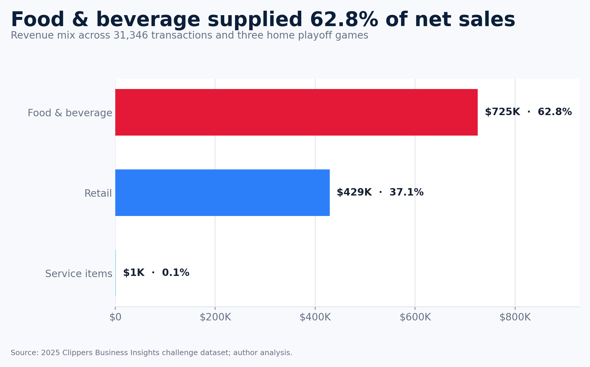

# Los Angeles Clippers arena-store analysis

A reproducible, privacy-conscious analysis of net sales and store-entry activity at Intuit Dome during three 2025 Clippers–Nuggets playoff games.

The project separates what the data **supports** from what it cannot identify. It calculates transaction economics at the transaction level, normalizes demand to each game's scheduled tipoff, validates every store join, and does not claim individual visitor-to-purchaser conversion because the supplied identifiers do not connect.

## Results at a glance

| Metric | Result |
|---|---:|
| Net sales | **$1,155,790.74** |
| Transactions | **31,346** |
| Purchasing accounts | **16,835** |
| Food & beverage share | **62.8%** |
| Retail share | **37.1%** |
| Food & beverage vs. retail | **1.69×**, or **69.1% higher** |
| Highest-revenue hour | **Final hour before tipoff in all 3 games** |
| Retail-store average transaction | **$88.44** |
| Mixed-store average transaction | **$27.38** |
| Store-entry identifier linkage | **Unavailable: 0 matching IDs** |



## What changed in this revision

- Replaced the mean line-item value with a true transaction-level average.
- Corrected “1.7% better” to **1.69× / 69.1% higher** for food & beverage versus retail sales.
- Replaced unsupported pregame/halftime/quarter labels with hours relative to scheduled tipoff.
- Distinguished revenue peaks from transaction-count peaks.
- Removed the unsupported store-entry-to-purchase conversion claim.
- Validated store joins as many-to-one and reconciled row counts and net sales before and after mapping.
- Flagged 94 duplicate-looking sales lines rather than deleting them without a source line identifier.
- Documented 1,169 zero-net lines, 578 zero-net transactions, an empty pricing-map sheet, incomplete checkpoint mapping, and identifier incompatibility.
- Rebuilt the notebook with repository-relative paths and embedded, executed outputs.
- Added automated tests, a data dictionary, methodology notes, a multi-page report, and an editable slide deck.
- Removed direct identifiers and the raw workbook from the public package.

See [docs/AUDIT_NOTES.md](docs/AUDIT_NOTES.md) for the complete issue-to-fix map.

## Repository structure

```text
assets/                 Generated figures
data/
  processed/            De-identified aggregate CSVs used by the notebook
  raw/                   Local-only source workbook location; ignored by Git
docs/                    Methodology, data dictionary, and audit notes
notebook/                Executed analysis notebook
report/                  PDF report plus editable DOCX and PPTX deliverables
scripts/                 Data, chart, notebook, report, and deck builders
src/                     Validated analysis transformations
tests/                   Standard-library unit tests
```

## Run the public analysis

Python 3.11 or newer is recommended.

```bash
python -m venv .venv
source .venv/bin/activate
python -m pip install -r requirements.txt
python -m unittest discover -s tests -v
python scripts/render_charts.py
python scripts/build_notebook.py
```

Open `notebook/intuit_dome_store_analysis.ipynb`. It reads the included aggregate CSVs and does not require the private workbook.

## Deliverables

- `notebook/intuit_dome_store_analysis.ipynb` — executed analysis with embedded outputs.
- `report/intuit_dome_arena_store_analysis.pdf` — six-page written report.
- `report/intuit_dome_arena_store_analysis.docx` — editable report source.
- `report/intuit_dome_arena_store_analysis.pptx` — eight-slide deck with editable native charts and table.
- `report/intuit_dome_arena_store_analysis_slides.pdf` — portable deck export.

## Rebuild from the private workbook

The original XLSX is intentionally excluded. If you are authorized to use it, place it under `data/raw/` or point to it anywhere on your machine:

```bash
python scripts/build_public_data.py --workbook "/path/to/challenge-dataset.xlsx"
python scripts/render_charts.py
python scripts/build_notebook.py
python -m unittest discover -s tests -v
```

The build writes aggregate tables only. It never exports customer accounts, NBA IDs, event IDs, transaction IDs, product IDs, exact transaction timestamps, distance-to-venue values, or app-creation timestamps.

## Methodology

The source workbook contains three sales sheets, three store-entry sheets, arena entry scans, a customer crosswalk, a store lookup, and an empty arena-pricing worksheet.

Core rules:

1. Trim identifier whitespace before joins.
2. Attach `StoreNames` to sales with a validated many-to-one join.
3. Aggregate line items to one row per game and transaction before calculating average transaction value.
4. Treat a business-vertical transaction as any transaction containing at least one line from that vertical; mixed transactions may appear in more than one vertical denominator.
5. Normalize timestamps to scheduled tipoff rather than comparing raw clock hours.
6. Treat StoreEntries rows as **events**, not attendees.
7. Do not estimate individual conversion without a verified person-level crosswalk.

Full definitions and validation logic are in [docs/METHODOLOGY.md](docs/METHODOLOGY.md) and [docs/DATA_DICTIONARY.md](docs/DATA_DICTIONARY.md).

## Findings and decision implications

- **Protect the final pregame hour.** It represented 34.0%, 35.6%, and 27.6% of game-level net sales. Test incremental staffing, replenishment, and queue coverage there, measuring service time, abandonment, revenue per minute, and out-of-stocks.
- **Treat retail as a high-ticket, lower-volume mission.** Retail stores averaged $88.44 per transaction versus $27.38 at mixed stores. Test attach offers or member prompts with a controlled rollout rather than assuming cross-sell behavior from aggregate data.
- **Investigate the game-to-game decline.** Net sales fell 22.8% from Game 3 to Game 6, while transactions fell 13.7% and average transaction value fell 10.6%. Attendance, open-store minutes, inventory, staffing, queues, promotions, and margins are needed to explain why.
- **Repair measurement before conversion analysis.** Add the two missing checkpoint mappings and provide a stable, governed identifier bridge across entries and purchases.

## Limitations

- The sample is three games in one playoff series; it is descriptive, not a full-season forecast.
- Net sales are not profit. Cost, margin, inventory, labor, queue, tax, refund, and availability fields were not supplied.
- Exact duplicate-looking rows were retained because the source has no immutable sales-line ID.
- Scheduled tipoffs are analysis anchors, not inferred game phases. Official game durations were 2:19, 2:30, and 2:13: [Apr 24](https://statsdmz.nba.com/pdfs/20250424/20250424_DENLAC.pdf), [Apr 26](https://statsdmz.nba.com/pdfs/20250426/20250426_DENLAC.pdf), and [May 1](https://statsdmz.nba.com/pdfs/20250501/20250501_DENLAC.pdf).

## Data use

No redistribution license accompanied the uploaded challenge workbook. The public package therefore includes only de-identified aggregates. See [DATA_USE.md](DATA_USE.md).

## Author

Oluwaseyi Caleb Folorunso
